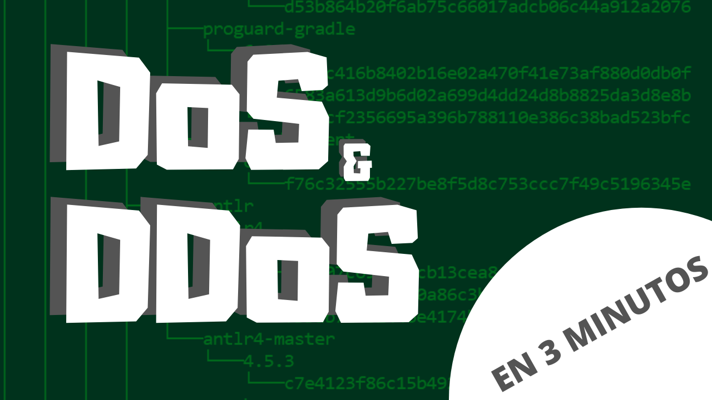

### Video: https://www.youtube.com/watch?v=QOldIGA1CPY

# Ataques DoS y DDoS explicados en 3 minutos
En [este](https://www.youtube.com/watch?v=QOldIGA1CPY), pequeño video te explico los **ataques de denegación de servicio** (DoS) y los ataques de denegación de servicio distribuidos.
Para el video no necesitamos escribir código, por lo que simplemente he subido a esta carpeta la presentación que he utilizado y la transcripción del video.

###### Video dirigido y producido por [Pablo Corbalán](https://github.com/pblcc) - Libre de derechos
