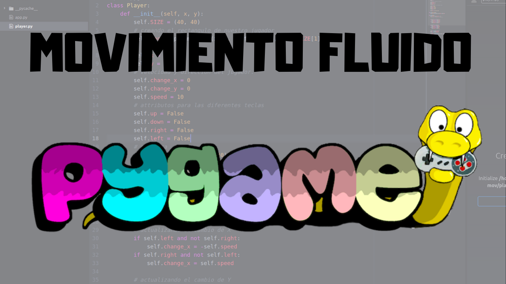

### Video: https://www.youtube.com/watch?v=5M6vzWFjVDQ

# Movimiento fluido en Pygame
En [este tutorial](https://www.youtube.com/watch?v=5M6vzWFjVDQ), enseño como puedes implementar un sistema de **movimiento fluido utilizando [Pygame](https://www.pygame.org)**
He dividido el repositorio en dos archivos principales
| Nombre | Descripción |
|--------|-------------|
| [app.py](https://github.com/PabloCorbCon/youtube/blob/master/pygame_smooth_movement/app.py) | El archivo principal de nuestra aplicación en Pygame. |
| [player.py](https://github.com/PabloCorbCon/youtube/blob/master/pygame_smooth_movement/player.py) | Aquí encontramos la clase `Player()` de la app. |

Si te interesa Pygame y **quieres mejorar la jugabilidad de tus juegos** o aplicaciones no dudes en ver el video.
###### Video dirigido y producido por [Pablo Corbalán](https://github.com/PabloCorbCon) - Libre de derechos

